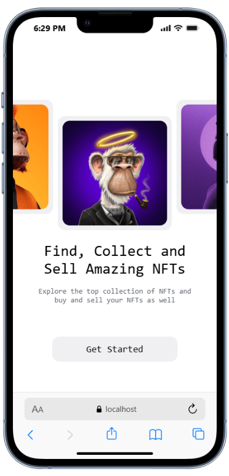
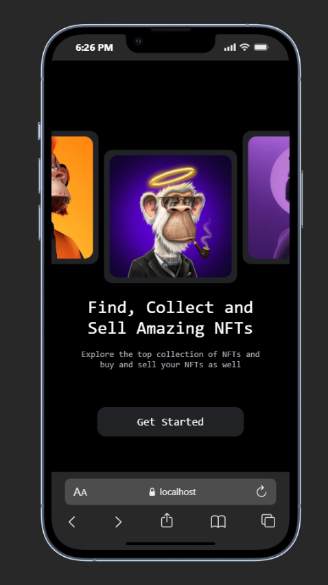
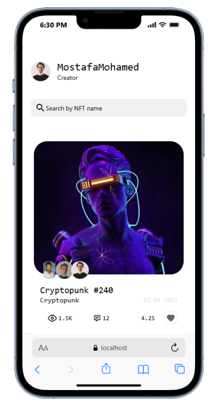
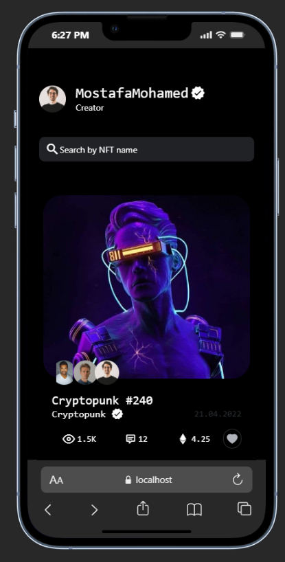
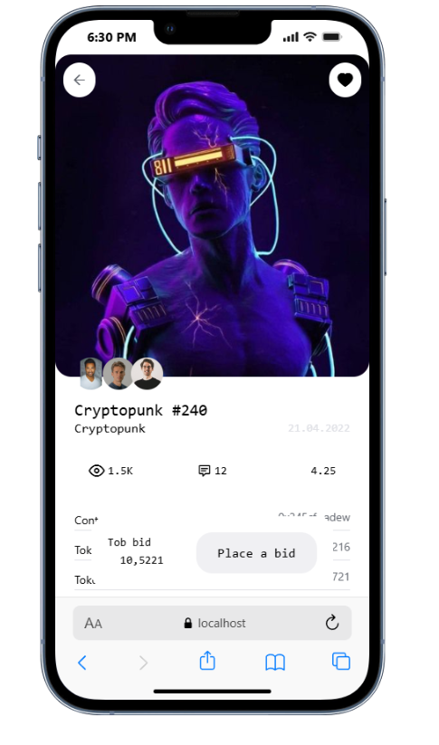
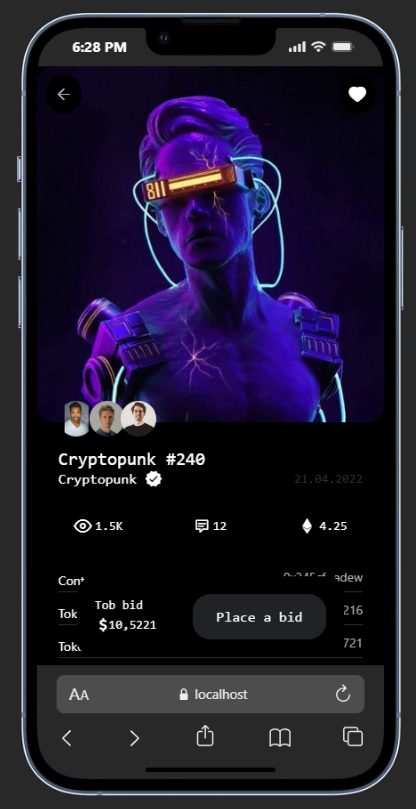

# NFT Cards

A clean and minimal React Native app for browsing and exploring NFT cards, with full dark mode support.

---

## Screenshots

### Welcome Screen

| Light | Dark |
|-------|------|
|  |  |

### Home Screen

| Light | Dark |
|-------|------|
|  |  |

### Details Screen

| Light | Dark |
|-------|------|
|  |  |

---

## Features

- Browse and explore NFT cards
- Smooth navigation across Welcome, Home, and Details screens
- Full dark mode support that adapts to system preferences

---

## Screens

**Welcome** — Entry point of the app. Introduces the experience and directs users to the main content.

**Home** — Displays the NFT card collection in a browsable layout.

**Details** — Shows in-depth information about a selected NFT card.

---

## Tech Stack

- [React Native](https://reactnative.dev/)
- Dark mode via `useColorScheme` / appearance API

---

## Getting Started

### Prerequisites

- Node.js
- React Native CLI or Expo CLI
- Android Studio / Xcode

### Installation

```bash
git clone https://github.com/Ahmedhany23/nft-react-native.git
cd nft-cards
npm install
```

### Run on Android

```bash
npx react-native run-android
```

### Run on iOS

```bash
npx react-native run-ios
```

---

## Dark Mode

The app automatically adapts to the device's system appearance. No manual toggle needed — switch your device to dark mode and the app follows.

---

## License

MIT